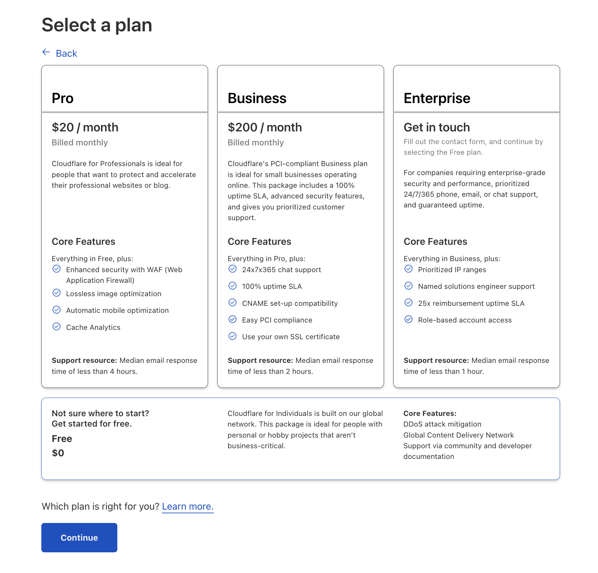

# add domain to Cloudflare
1-add-domain-cloudflare

Neu chua co tai khoan, hay dang ky.

Neu da co, hay dang nhap.

Them site (domain moi cua ban)

Go ten mien cua ban

Chon plan free

Bo qua phan add DNS record (minh se add sau)

Lay NameServer va doi Name Server cho ten mien moi

Vao trang https://id.tenten.vn/list-domain de doi NS

Cap nhat thong tin Name Server

Sau khi cap nhat, quay lai Cloudflare va skip recommendations config

Check nameservers

Done.